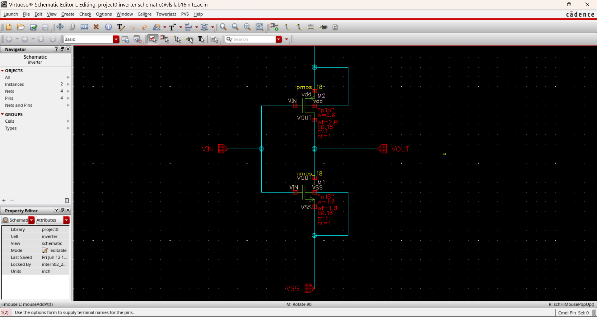
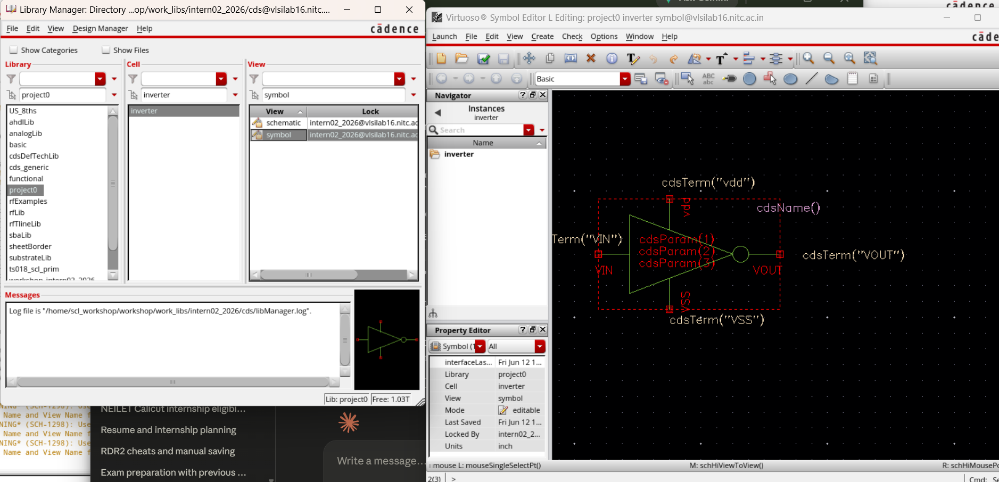
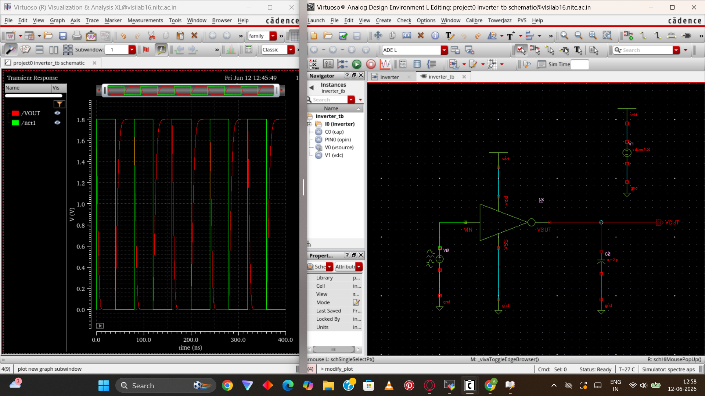
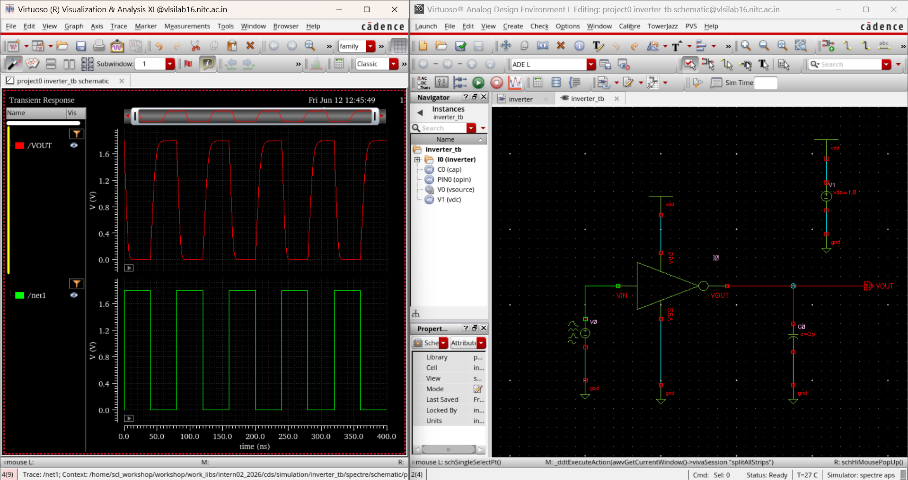
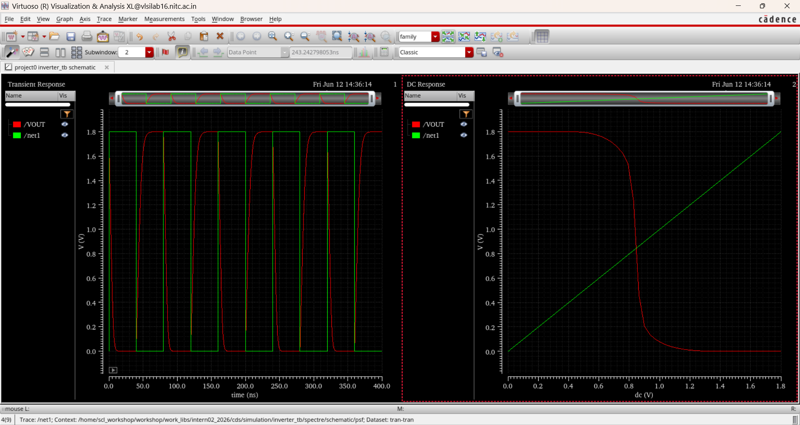
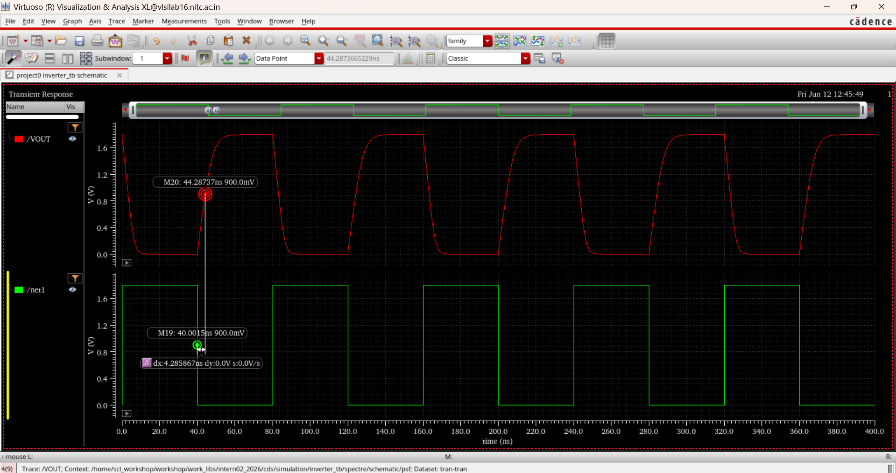
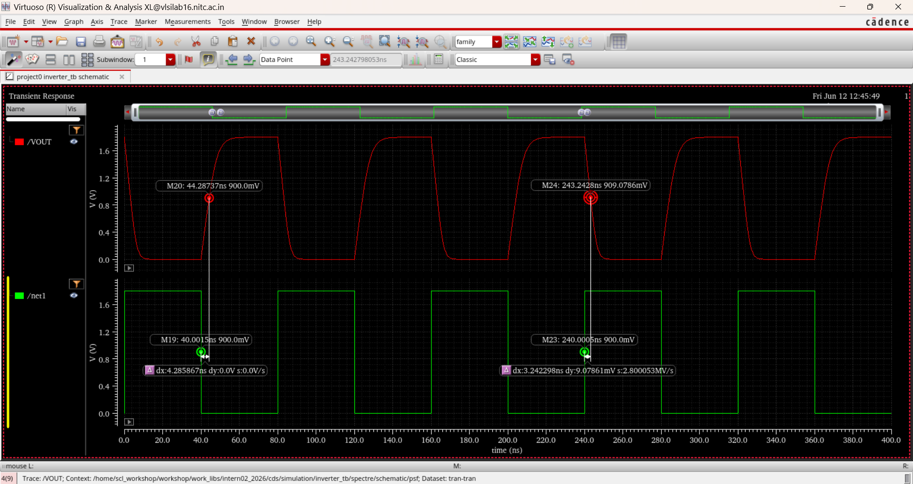
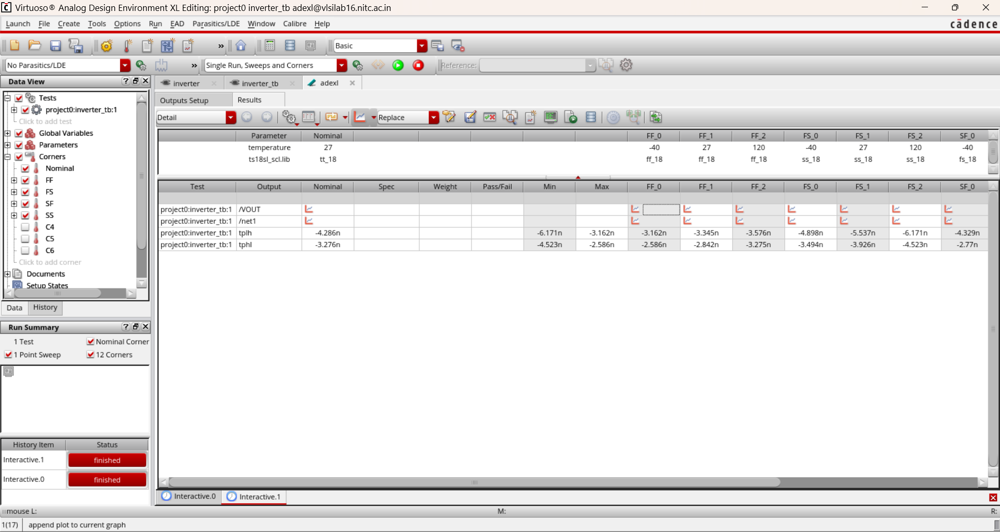
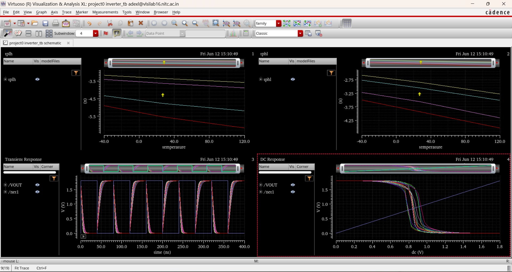

# Day 1 — June 12, 2026

**Focus:** Inverter schematic → symbol → testbench → transient → DC → propagation delay → PVT corners

## What I did

### Schematic
- Created `inverter` cell in `project0` library in Cadence Virtuoso
- Placed `pmos_18` and `nmos_18` from SCL 180nm PDK
- Sizing:
  - PMOS: W=2µm, L=0.18µm, nf=1, m=1
  - NMOS: W=1µm, L=0.18µm, nf=1, m=1
  - PMOS sized 2x NMOS to balance rise/fall times
- Connections:
  - Gates → VIN
  - Drains → VOUT
  - PMOS source → vdd
  - NMOS source → VSS
- Ran schematic check — no errors

  
*CMOS inverter schematic — PMOS (W=2µm) and NMOS (W=1µm), SCL 180nm PDK*

### Symbol
- Created symbol view from schematic (`Create → Cellview → From Cellview`)
- Pins: VIN (input), VOUT (output), vdd, VSS
- Auto-generated and saved

  
*Inverter symbol view — VIN (input), VOUT (output), vdd, VSS*

### Testbench (`inverter_tb`)
- Created `inverter_tb` cell (schematic view)
- Instantiated `inverter` symbol
- Added:
  - `V0` (vpulse): 0→1.8V, period 20ns, rise/fall 1ns
  - `V1` (vdc): VDD = 1.8V
  - `C0` (cap): load capacitor at output
- Wired IN, OUT, VDD, GND connections
- Note: always save cellview before running sim — ADE throws error otherwise

  
*inverter_tb schematic — vpulse input, VDD supply, load cap at output*

### Transient Simulation (ADE L)
- Stop time: 100ns, step: 10ps
- Output correctly inverts input, rail-to-rail swing 0→1.8V
- Propagation delay visible on waveform

  
*Transient output — rail-to-rail 0→1.8V swing, clean inversion*

### DC Simulation — VTC
- Swept VIN from 0 to 1.8V, step 1mV
- Classic S-curve VTC
- VM (switching threshold) ≈ 0.9V ≈ VDD/2 — good balance between PMOS and NMOS

  
*VTC (DC sweep) alongside transient — classic S-curve, VM ≈ 0.9V*

### Propagation Delay
- Used waveform markers on transient output at 50% crossing (900mV = VDD/2)
- **tpLH** (output low→high): ~4.286ns
- **tpHL** (output high→low): ~3.276ns
- Also measured using ADE calculator

  
*tpLH measurement — output low→high, 50% crossing at 900mV*

*tpHL measurement — output high→low, 50% crossing at 900mV*

### PVT Corner Analysis (ADE XL)
- Ran across 12 corners: Nominal, FF, FS, SF, SS at temps -40°C, 27°C, 120°C
- Process corners from `ts18sl_scl.lib`
- Outputs tracked: /VOUT, /net1, tpLH, tpHL
- Results:
  - tpLH nominal: -4.286ns | min: -3.162ns | max: -6.171ns
  - tpHL nominal: -3.276ns | min: -2.586ns | max: -4.523ns
- Plotted tpLH and tpHL vs temperature across corners
- SS corner (slow process, high temp) = worst case delay
- FF corner at low temp = best case (fastest)

  
*ADE XL corner results — tpLH and tpHL across 12 PVT corners*

*Transient waveforms overlaid across FF/SS/FS/SF corners*

## Key Concepts

**CMOS Inverter** — PMOS pulls output high when input is low; NMOS pulls output low when input is high. Rail-to-rail swing with near-zero static power.

**W/L Ratio** — Determines transistor drive strength. PMOS has lower mobility than NMOS, so sized 2x wider to balance rise/fall times.

**SCL 180nm PDK** — Process Design Kit from Semiconductor Complex Limited. Provides verified device models (`pmos_18`, `nmos_18`) for 180nm node.

**vpulse** — Voltage source with V1 (low), V2 (high), period, rise/fall time, delay parameters.

**VTC (Voltage Transfer Characteristic)** — DC sweep output. Tells you VOH, VOL, VIH, VIL, noise margins, and VM.

**Propagation Delay** — Measured at 50% crossing of VDD. tpLH = output rising delay, tpHL = output falling delay. Average = tp.

**PVT Corners** — Process (FF/SS/FS/SF), Voltage, Temperature variations. SS + high temp = worst case timing. FF + low temp = best case.

## Next
- Inverter layout
- DRC, LVS, PEX, post-layout simulation
