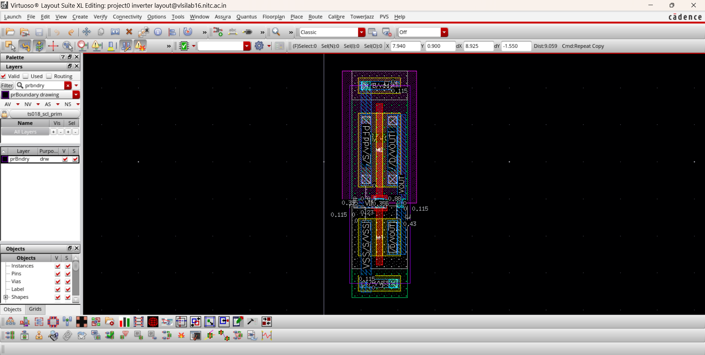
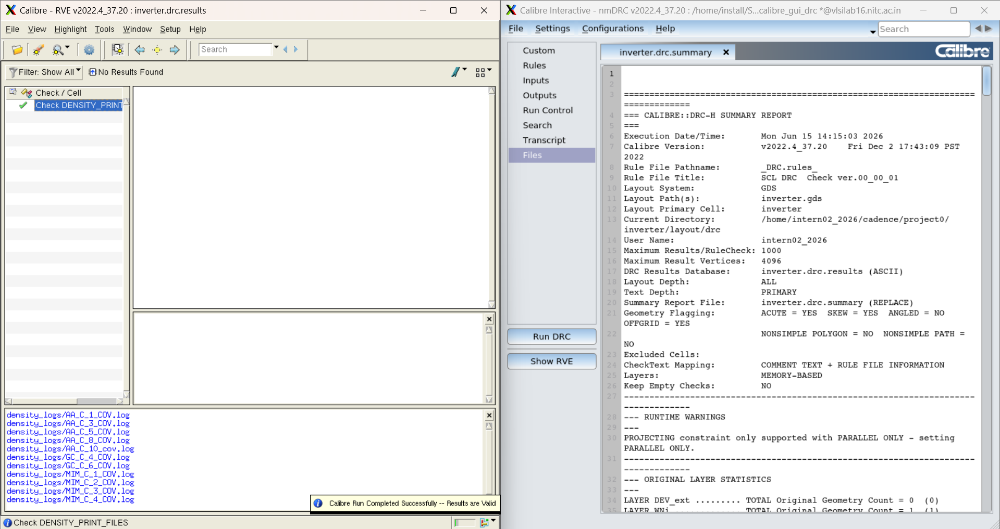
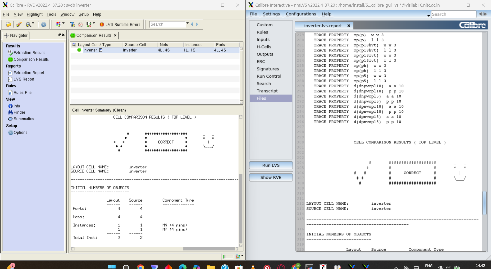
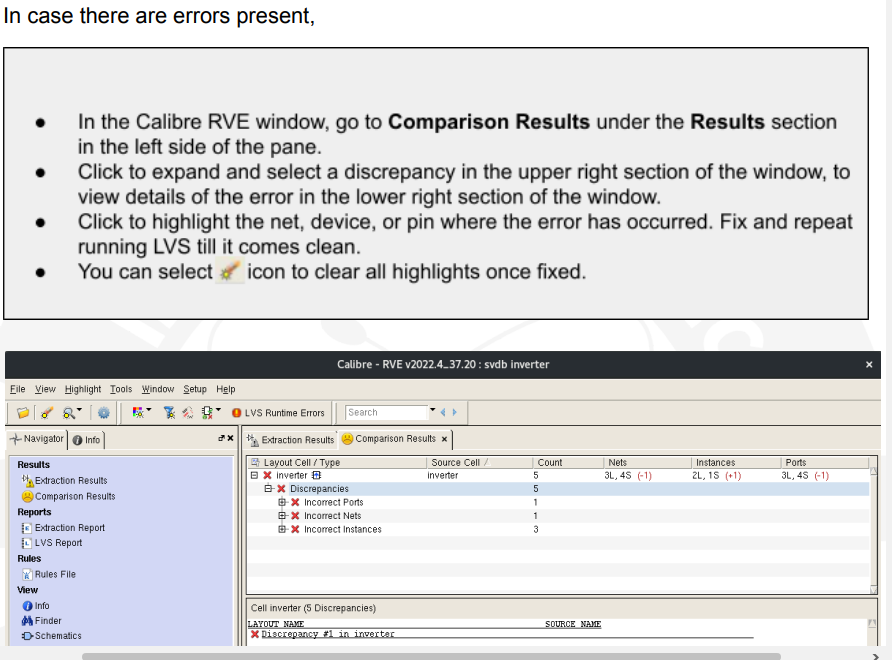
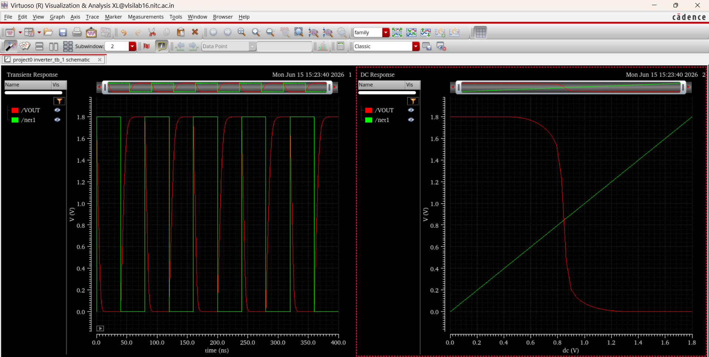

# Day 2 — June 15, 2026

**Focus:** Inverter layout → DRC → LVS → PEX → post-layout simulation

## What I did

### Layout

Opened the layout view for the `inverter` cell in `project0`. Placed `pmos_18` and `nmos_18` pcells from the SCL 180nm PDK. Before placement, enabled body taps on each transistor via Q → Parameter tab → Show Tap Props:
- PMOS: enabled `topTap` and `topTapM1` (bulk → VDD)
- NMOS: enabled `bottomTap` and `bottomTapM1` (bulk → VSS)

Aligned the poly gates of both transistors using ruler (`K`) and align (`A`). SCL 180nm rules require a minimum 0.43µm spacing between the NMOS active area and the bottom edge of the PMOS N-well — measured with ruler and aligned accordingly.

Routed connections:
- **M1 layer:** VDD (PMOS source → body tap), VSS (NMOS source → body tap), VOUT (shared drain)
- **GC layer:** VIN gate line connecting both transistors

Placed all four pins (VIN, VOUT, VDD, VSS) on top of their M1 drawing geometries. Drew PR boundary to define cell extent.

*Final inverter layout — PMOS/NMOS pcells, body taps, M1 routing, PR boundary*

### DRC — Calibre nmDRC

- Rule file: SCL DRC Check ver.00_00_01
- 16 rulechecks executed
- **Result: 0 violations**

  
*Calibre nmDRC — 0 violations, SCL 180nm rule deck*

### LVS — Calibre nmLVS

- Compared layout netlist vs schematic netlist
- Ports: 4L = 4S | Nets: 4L = 4S | Instances: 2L = 2S (MN + MP)
- **Result: CORRECT**

  
*Calibre nmLVS — CORRECT, 4 ports, 4 nets, 2 instances*

### PEX — Calibre xRC

- Extracted parasitic RC netlist for all 4 nets (VIN, VSS, vdd, VOUT)
- Output: `inverter.pex.netlist`
- xRC Errors: 0 | xRC Warnings: 7 (undefined ground layers — isp, SNU, DNWELL — harmless server config issue)
- **Result: Extraction successful**

  
*Calibre xRC — 0 errors, parasitic RC extracted for all 4 nets*

### Post-Layout Simulation

Opened ADE L, loaded previous session state via Session → Load State. Added the PEX netlist under Setup → Model Libraries.

Hit netlisting error (OSSHNL-109) — `inverter_tb_1` schematic had unsaved modifications. Fixed by opening testbench schematic and running Check & Save. Also updated CDF termOrder to match PEX netlist pin order: `VIN VSS vdd VOUT`.

Re-ran transient (0–400ns) and DC sweep (0–1.8V):
- Output correctly inverts input, rail-to-rail swing 0–1.8V
- VTC transition at ~0.9V
- Edge rounding visible on transient waveform compared to pre-layout — expected effect of parasitic capacitance

  
*Post-layout transient and DC — slight edge rounding from extracted parasitics*

## Pre vs Post Layout

| | Pre-Layout | Post-Layout |
|---|---|---|
| Logic swing | 0 – 1.8V | 0 – 1.8V |
| VTC transition | ~0.9V | ~0.9V |
| Edge shape | Ideal sharp switching | Slight rounding due to parasitic C |

## Key Concepts

**Fingers vs Multipliers** — Fingers divide the gate width into parallel sections physically but don't change circuit behaviour — safe to modify at layout stage. Multipliers scale the diffusion area and change the effective W/L ratio — must be set during schematic design only.

**Body taps** — Connects the bulk terminal of each transistor to its supply. PMOS bulk → VDD (topTap), NMOS bulk → VSS (bottomTap). Prevents latch-up in CMOS circuits.

**Abutment** — When two adjacent transistors share a terminal, drag them together until the shared terminal overlaps. Virtuoso auto-detects and merges the common node.

**PR Boundary** — Defines the physical extent of the cell. Required for placement in larger designs and for Calibre to know the cell boundary during DRC/LVS.

**DRC (Design Rule Check)** — Checks that every shape in the layout satisfies the PDK's physical design rules: minimum width, spacing, enclosure, well rules etc. Purely geometric — has nothing to do with circuit correctness.

**LVS (Layout vs Schematic)** — Extracts a netlist from the layout and compares it to the schematic netlist. Confirms that what you drew is electrically equivalent to what you designed.

**PEX (Parasitic Extraction)** — Extracts parasitic R and C from the physical geometry of the layout. The resulting netlist is used for post-layout simulation, which gives a more realistic picture of circuit performance than the ideal schematic sim.

## Resources

- SCL 180nm PDK Design Rules — referenced via Calibre rule file `_DRC_rules_`
- Calibre nmDRC/nmLVS/xRC v2022.4 — physical verification tools
- Cadence Virtuoso Layout Suite XL IC618 — layout editor
- NIT Calicut analog VLSI lab manual (Part 1, 66 pages) — followed for full flow

## Next

- Part 2 of manual: I/O Ring Design
- Stream in GDS pad cells (cio150 / cio250) from SCL PDK
