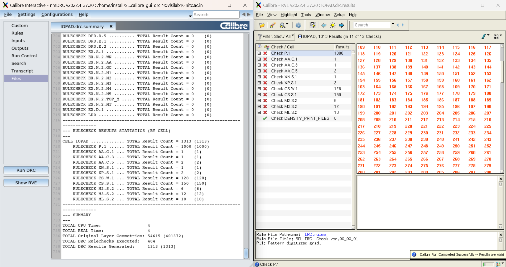
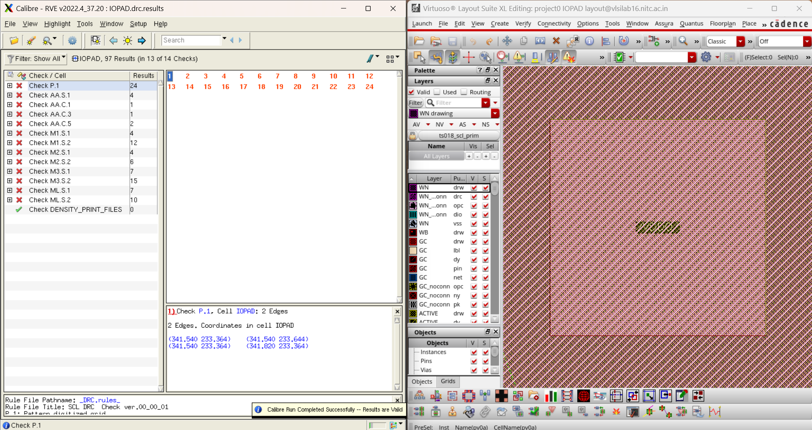
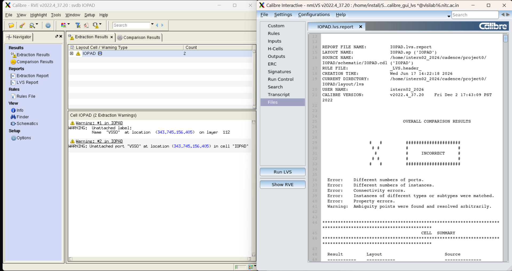
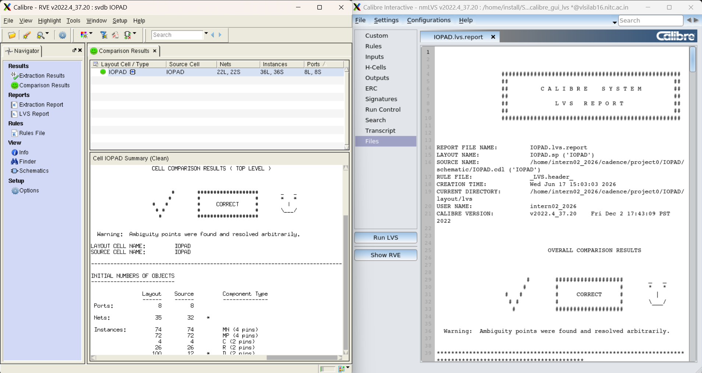
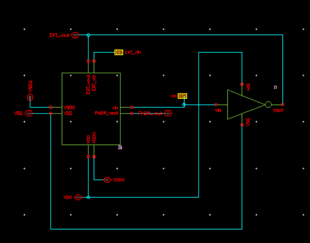
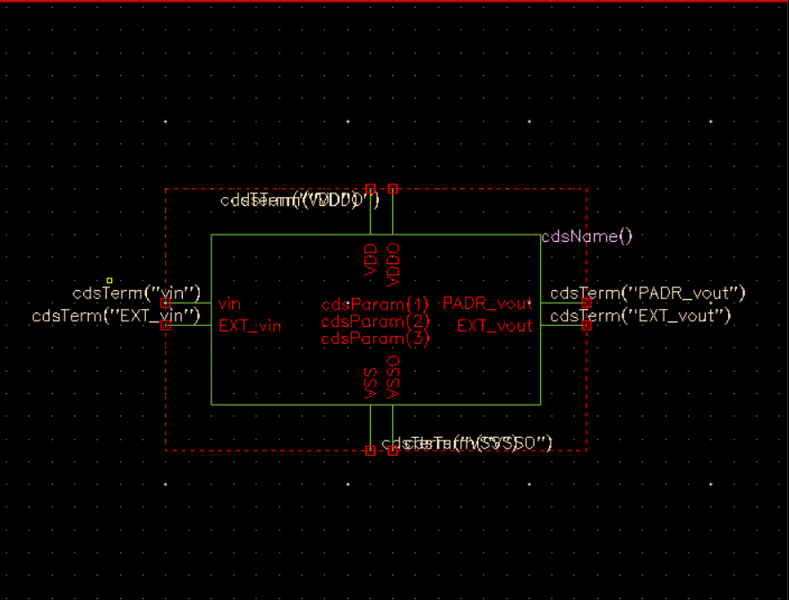

# Day 4 — June 17, 2026

**Focus:** IOPAD layout DRC fixes → LVS → CDL export & editing → final_chip schematic + symbol

## Summary
Continued from Day 3's IOPAD layout. Started with 1030 DRC errors, fixed through repeated alignment corrections, redid layout cleanly and got down to 6 waivable density errors. Ran LVS, debugged CDL pin order issues, got CORRECT. Created final_chip schematic integrating IO ring + inverter core, generated symbol.

---

## What I Did

### 1. DRC Iteration — IOPAD Layout

Made alignment corrections to pad cell abutment and re-ran Calibre nmDRC repeatedly:

| Run | Errors | Action |
|-----|--------|--------|
| Start of day | 1030 | — |
| After alignment fixes | 97 | Fixed pad cell abutting |
| After more corrections | 28 | More alignment work |
| After redo from scratch | **6** | Deleted old layout, placed cleanly |

Remaining 6 errors are all `AA.C` type — Active Area density violations. These are waivable at this stage and get resolved during dummy fill insertion in later steps. Lab assistant confirmed this.

Error categories encountered during iteration:
- `P.1` — Poly spacing violations near pad routing (24 at peak → 0 after redo)
- `AA.S.1`, `AA.C.1`, `AA.C.3`, `AA.C.5` — Active area shape/density issues
- `M1.S`, `M2.S`, `M3.S`, `ML.S` — Metal spacing from misaligned pad boundaries (all → 0)

**Key lesson:** AA.C.1 showed a 14-vertex irregular active polygon spanning the full IOPAD width. This was caused by merged active layers at misaligned pad cell boundaries — the fix was redoing the placement cleanly, not editing individual shapes.

*Early DRC run — misaligned pad abutment causing poly/metal spacing and active area errors*

*DRC after clean redo — 6 waivable AA.C density errors, all other rules passing*

### 2. CDL Export

Exported schematic netlist from CIW:
`File → Export → CDL`

Settings used:
| Field | Value |
|---|---|
| Library | project0 |
| Cell | IOPAD |
| View | schematic |
| Output File | IOPAD.cdl |
| Run Directory | `/home/intern02_2026/cadence/project0/IOPAD/schematic/` |
| Netlisting Mode | Analog |
| Scale | meter |

Output: `IOPAD.cdl` generated successfully.

### 3. CDL Manual Editing

The auto-generated CDL had stub definitions for all pad cells (empty — no transistor content). Edited the file manually:

1. Backed up: `cp IOPAD.cdl IOPAD_backup.cdl`
2. Opened in gedit
3. Commented out all 5 stub subcircuits (pvdi, pv0i, pvda, pv0a, pc3d00) by adding `*` to each line
4. Opened PDK reference CDL: `/home/install/SCL/scl180/iopad/cio150/4M1L/cdl/tsl18cio150.cdl`
5. Copied full transistor-level definitions for all 5 cells
6. Pasted at top of IOPAD.cdl after `.PARAM` line
7. Fixed pin order in instance calls to match PDK subcircuit definitions:

| Cell | Correct PDK Pin Order |
|---|---|
| pvdi | VDD VSS VDDO VSSO |
| pv0i | VSS VDD VDDO VSSO |
| pvda | VDDO VDD VSS VSSO |
| pv0a | VSSO VDD VSS VDDO |
| pc3d00 | PAD PADR VDD VSS VDDO VSSO |

### 4. LVS — Calibre nmLVS on IOPAD

**First run: INCORRECT**
- Ports: 7L, 8S (-1) — VSSO pin missing
- Instances: 36L, 42S (-6) — pin order mismatch cascading
- 19 discrepancies total

Fixes applied:
- Placed `VSSO` pin on M3 metal shape at IOPAD top level (was floating in empty space)
- Fixed pin order for all 5 pad cells in IOPAD.cdl instance calls

**Second run: CORRECT ✅**
- Ports: 8L = 8S
- Nets: 22L = 22S  
- Instances: 36L = 36S

*First LVS run — INCORRECT, VSSO port missing, pin order mismatch causing 19 discrepancies*

*Second LVS run — CORRECT, 8 ports, 22 nets, 36 instances*

### 5. final_chip Schematic (Section 3.1)

Created new schematic cellview `final_chip` in `project0`:

Instances placed:
- `IOPAD` symbol (IO ring)
- `inverter` symbol (core logic)

Pins created (all type `inputOutput`):
| Pin | Role |
|-----|------|
| EXT_vin | External input (bond pad side) |
| EXT_vout | External output (bond pad side) |
| PADR_vout | Internal — IOPAD PADR to inverter input |
| vin | Internal — inverter input net |
| VDD, VSS, VDDO, VSSO | Power |

Connections:
- `IOPAD.vin` → `vin` → `inverter.VIN`
- `inverter.VOUT` → `IOPAD.EXT_vout`
- `IOPAD.PADR_vout` → `PADR_vout` pin
- `IOPAD.EXT_vin` → `EXT_vin` pin
- Power connected to corresponding IOPAD terminals

Check and Save: **no errors** ✅

*final_chip schematic — IOPAD + inverter instances, 8 pins, power and signal connections*

### 6. final_chip Symbol

Created symbol from schematic (`Create → Cellview → From Cellview`). 8 pins auto-placed:
- Left: `vin`, `EXT_vin`
- Right: `PADR_vout`, `EXT_vout`
- Top: `VDD`, `VDDO`
- Bottom: `VSS`, `VSSO`

Saved. Ready for testbench instantiation.

*final_chip symbol — 8 pins auto-placed from schematic*

---

## Key Concepts

**AA Density Rules** — Active area must cover a minimum percentage of any 100×100µm window. With just an inverter + IO ring, density is naturally low. Waivable — resolved by dummy fill in final assembly.

**CDL Stub vs Full Definition** — Auto-exported CDL from Cadence generates empty stubs for PDK cells (only `.PININFO`, no transistors). LVS needs full transistor-level content. Fix: comment stubs, paste full definitions from PDK CDL file.

**Pin Order in CDL** — CDL is positional. Pin connections assigned by order, not name. A single swap causes LVS to see completely wrong net connections. Always verify instance call order against PDK subcircuit header.

**Unattached Port in LVS** — If a pin label in layout isn't sitting on a connected metal shape, LVS reports it as an unattached port. Must be at the correct hierarchy level (top cell, not inside a subcell instance).

---

## Issues & Fixes

| Issue | Root Cause | Fix |
|-------|-----------|-----|
| 1030 DRC errors | Pad cells not properly abutted | Redo layout with clean placement |
| AA.C.1 — 14-vertex active polygon | Merged active from misaligned pads | Redo layout |
| LVS: VSSO port missing | Pin placed floating, not on metal | Place VSSO pin on M3 shape at top level |
| LVS: 42S vs 36L instances | Wrong pin order in CDL instance calls | Fix all 5 pad cell instance calls to match PDK order |
| Symbol had duplicate EXT_vin | Added vin as pin then regenerated symbol | Corrected schematic, regenerated symbol |

---

## Resources

- PDK pad CDL: `/home/install/SCL/scl180/iopad/cio150/4M1L/cdl/tsl18cio150.cdl`
- Calibre nmDRC/nmLVS v2022.4
- NIT Calicut analog VLSI lab manual (Part 2) — Sections 2.4, 3.1

---

## Next

- Section 3.2: `final_chip` layout — place IOPAD layout + inverter layout, connect power rings
- DRC + LVS on `final_chip`
- PEX on `final_chip`
- Post-layout simulation with full chip parasitics
