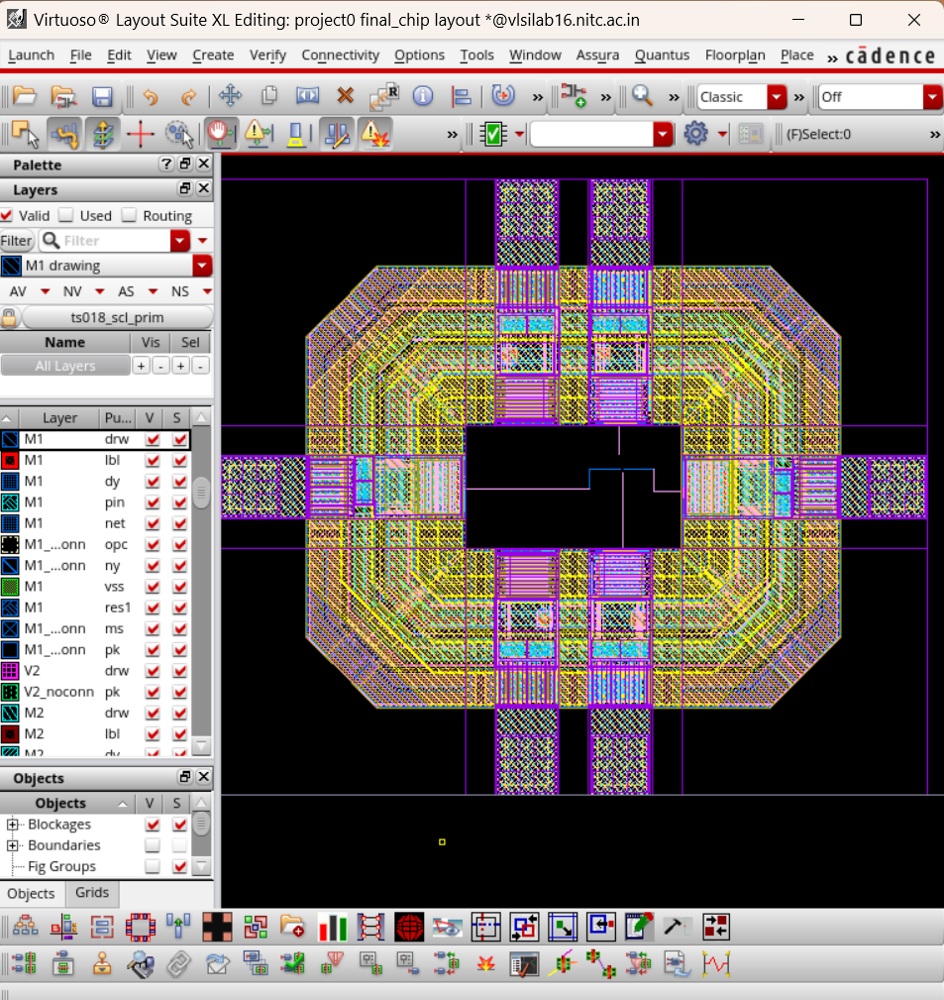
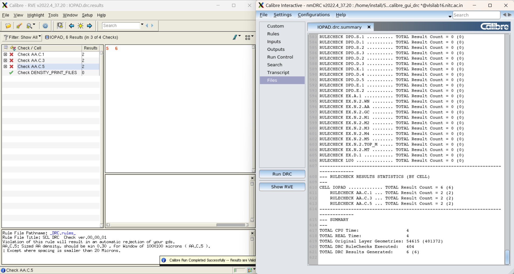
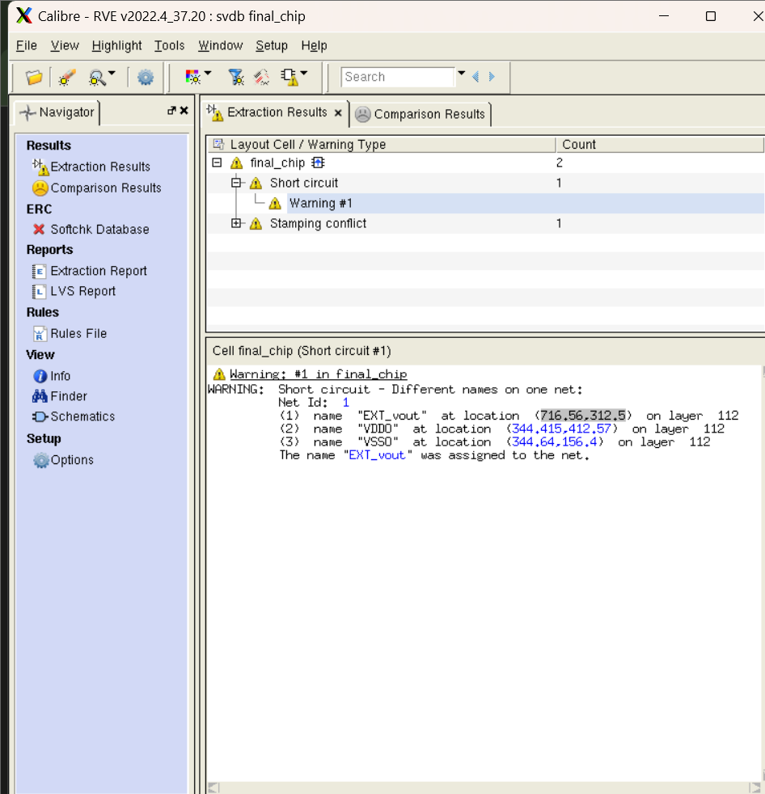
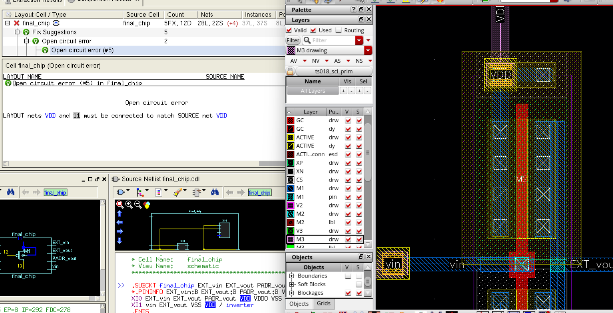
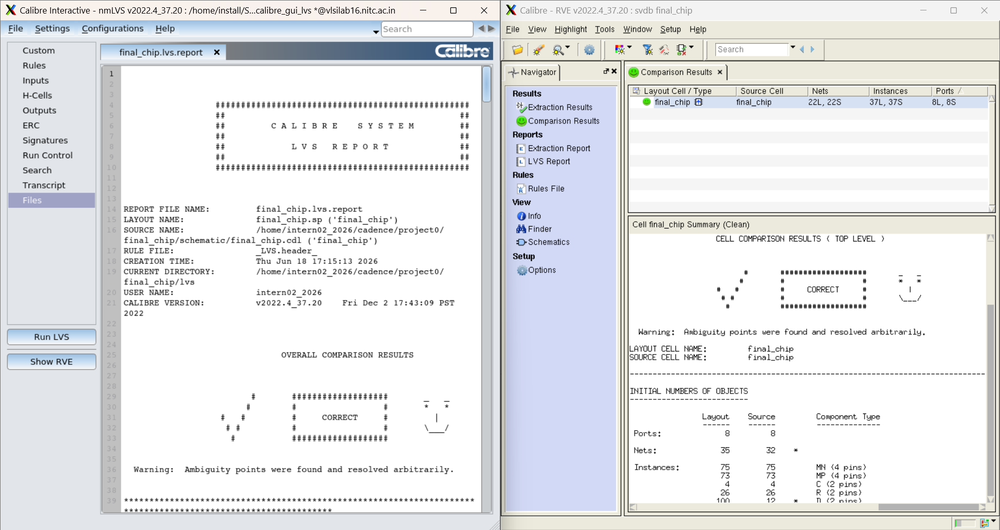

# Day 5 — June 18, 2026

**Focus:** `final_chip` layout → DRC → LVS (full chip physical verification)

## Summary
Integrated the CMOS inverter into the IO ring to build the complete `final_chip` layout. Ran DRC (6 waivable density errors) and LVS — debugged through short circuits, CDL hierarchy issues, pin signal type mismatches, and via stack errors before achieving LVS CORRECT.

---

## What I Did

### 1. final_chip Layout Setup
- Created layout view for `final_chip` via `Connectivity → Generate → All From Source`
- I/O Pins tab: all 8 pins on M3 pin layer, 0.28 × 0.28 size
- Placed `IOPAD` instance (full IO ring) and `inverter` instance at die area center

### 2. External Pin Placement
- Placed new `EXT_vin` pin 0.5µm from existing pad pin on left IO pad (pad area)
- Placed new `EXT_vout` pin 0.5µm from existing pad pin on right IO pad (pad area)
- 0.5µm gap causes rat's nest (white unconnected net indicators) — expected; resolved by routing a short wire between old and new pins

**PAD vs PADR distinction:**
| Terminal | Location | Used for |
|----------|----------|----------|
| PADR | Die-facing end only | Input signals entering die |
| PAD | Both ends (bond + die side) | Output signals leaving die |

### 3. Signal Routing
- `vin`: left IO pad PADR terminal → inverter VIN (long horizontal M3 route across die)
- `EXT_vout`: inverter VOUT → right IO pad EXT_vout pin (M3)
- Rat's nest lines confirmed connections after routing


*final_chip layout — IOPAD ring with inverter at die center, M3 signal routing, via stacks for power*

### 4. Power Connections (Critical — see Issues below)
- VDD ring on **M3**, inverter `vdd` pin on **M1** → required full via stack
- VSS ring on **M3**, inverter `vss` pin on **M1** → required full via stack
- Via stack used: M1 → **V1 (M1_M2 via)** → M2 → **V2 (M2_M3 via)** → M3
- Must explicitly place both via types — default via only places one

---

## DRC Results
- **6 errors** — all `AA.C` density violations (AA.C.1 × 1, AA.C.3 × 2, AA.C.5 × 3)
- Waivable — sparse die area with single inverter causes low active density
- Resolved by dummy fill in later assembly steps


*final_chip DRC — 6 waivable AA.C density errors, all other rules clean*

---

## CDL Export & Editing

Exported via `File → Export → CDL`:
| Field | Value |
|-------|-------|
| Library | project0 |
| Cell | final_chip |
| View | schematic |
| Output | `final_chip.cdl` |
| Run Directory | `/home/intern02_2026/cadence/project0/final_chip/schematic/` |
| Mode | Analog |

### Required Edits to CDL

**1. Replace empty pad stubs with full transistor definitions**
Auto-generated CDL has empty stubs for all 5 pad cells. Replace with full subcircuit definitions from:
```
/home/install/SCL/scl180/iopad/cio150/4M1L/cdl/tsl18cio150.cdl
```
Pin order in `.SUBCKT` line must match your schematic, not the PDK default order.

**2. Remove rogue `.SUBCKT pvdc` line**
PDK CDL contains an orphaned `.SUBCKT pvdc VDDC VDD VSS VDDO VSSO` line (no matching `.ENDS`) sitting between pvda and pv0a. This silently breaks Calibre CDL parsing — error shown: *"Source primary cell not found in source database"*. Delete this line entirely.

**3. W/L units — uppercase U**
Manual specifies uppercase `U`, not lowercase `u`:
```spice
MM1 VOUT VIN VSS VSS N W=1.0U L=0.18U m=1.0
MM2 VOUT VIN vdd vdd P W=2.0U L=0.18U m=1.0
```
Same for all internal transistors in pad cell subcircuits.

**4. Leave `final_chip` and `IOPAD` subcircuits untouched**

---

## Schematic Fix — VSS Pin Signal Type

VSS and VSSO pins in `final_chip` schematic had `Signal Type = ground`. Must be `signal` (same rule as IO pad pins on Day 3).

Fix:
1. Open `final_chip` schematic
2. Select VSS pin → `Q` → change Signal Type from `ground` → `signal`
3. Repeat for VSSO
4. Check and Save → regenerate CDL

---

## LVS — Calibre nmLVS

Settings: identical to IOPAD LVS from Section 2.4. "Export from layout viewer" checkbox handles automatic GDS export on each run — no manual export needed.

### Debug Iterations

| Run | Result | Issue | Fix |
|-----|--------|-------|-----|
| 1 | INCORRECT | `pvdc` stub breaking CDL parse — "primary cell not found" | Delete rogue `.SUBCKT pvdc` line |
| 2 | INCORRECT | 30 extra instances in layout — pad stubs empty | Paste full pad transistor definitions from PDK CDL |
| 3 | INCORRECT | Short circuit: EXT_vout + PADR_vout + VDDO + VSSO on same net | EXT_vout and PADR_vout pins were overlapping in layout — separated them |
| 4 | INCORRECT | Open circuit: VDD net and net 10/11 not connected | Inverter `vdd` on M1, VDD ring on M3 — missing via stack |
| 5 | INCORRECT | VSS/VSSO pin type mismatch | Changed signal type from `ground` → `signal` in schematic, regenerated CDL |
| 6 | **CORRECT ✅** | — | Full M1→M2→M3 via stack placed correctly |


*LVS Run 3 — EXT_vout and PADR_vout pins overlapping, causing short to VDDO/VSSO*


*LVS Run 4 — VDD open circuit, inverter vdd on M1 not connected to M3 power ring*

### Final LVS Result
```
Nets:      22L = 22S  ✅
Instances: 37L = 37S  ✅
Ports:     8L  = 8S   ✅
Warning:   Ambiguity points resolved arbitrarily (harmless)
```


*LVS Run 6 — CORRECT, 22 nets, 37 instances, 8 ports*

---

## Key Concepts

**Via Stack (M1→M3)** — When connecting a signal on M1 to a net on M3, two separate vias are needed: one M1_M2 via and one M2_M3 via, with a short M2 segment in between. Placing only the default via inserts one type and leaves the connection incomplete. Always check what metal layer the destination (e.g. power ring) is on before routing.

**PAD vs PADR** — PADR terminal exists only at the die-facing end of the IO pad. PAD exists at both the bond wire end and the die-facing end. For input signals: connect to PADR (die-facing). For output signals: connect to PAD.

**CDL Stub vs Full Definition** — auCDL auto-export generates empty stubs for PDK cells. LVS needs full transistor content. Replace stubs with definitions from the PDK's reference CDL file.

**Orphaned SUBCKT** — A `.SUBCKT` line in a CDL without a matching `.ENDS` causes Calibre to fail parsing the entire file silently. Error message is misleading ("primary cell not found") — actual cause is a broken subcircuit upstream.

**W/L Unit Case** — Calibre LVS treats `W=1.0u` and `W=1.0U` differently. The SCL 180nm LVS runset expects uppercase `U`. Lowercase causes property errors even if the value is numerically correct.

**Signal Type for VSS Pins** — Setting a pin to `Signal Type = ground` in Cadence schematic changes how auCDL exports the net. For IO pad designs, all pins including VSS/VSSO must be `signal` type to ensure correct LVS net matching.

---

## Issues & Fixes

| Issue | Root Cause | Fix |
|-------|-----------|-----|
| "Source primary cell not found" | Orphaned `.SUBCKT pvdc` in CDL | Delete the rogue pvdc line |
| 30 extra layout instances | Pad cell CDL stubs were empty | Paste full transistor definitions from PDK CDL |
| EXT_vout short to VDDO/VSSO | EXT_vout and PADR_vout pins overlapping in layout | Separate the two pin placements |
| VDD open circuit (net 10/11) | VDD ring on M3, inverter vdd pin on M1 — only default via placed | Route with full M1_M2 + M2_M3 via stack |
| LVS property errors | W/L used lowercase `u` instead of `U` | Change to uppercase `U` throughout CDL |
| VSS net mismatch | VSS/VSSO pin signal type was `ground` in schematic | Change to `signal` type, regenerate CDL |

---

## Resources
- PDK pad CDL: `/home/install/SCL/scl180/iopad/cio150/4M1L/cdl/tsl18cio150.cdl`
- Calibre nmDRC/nmLVS v2022.4
- NIT Calicut analog VLSI lab manual (Part 2) — Section 3.2, 3.3

---

## Next
- PEX on `final_chip` (Calibre xRC)
- Post-layout simulation with full chip parasitics
