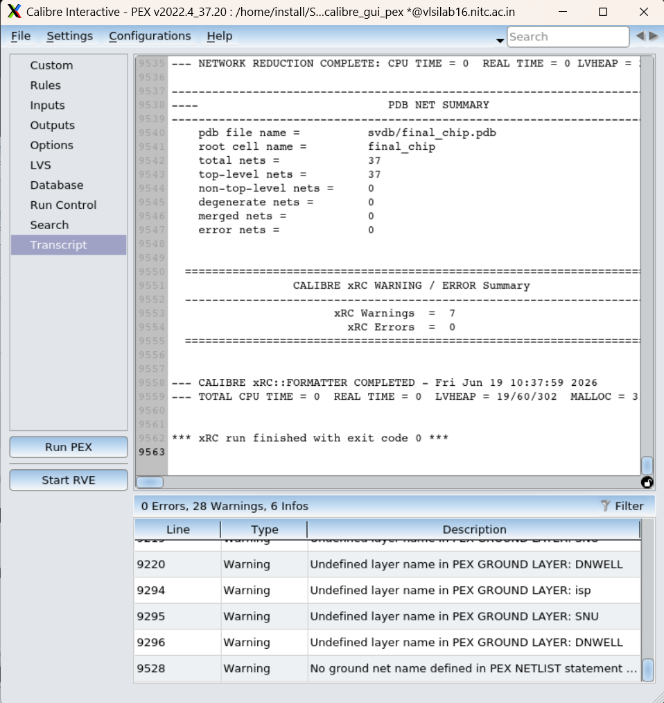
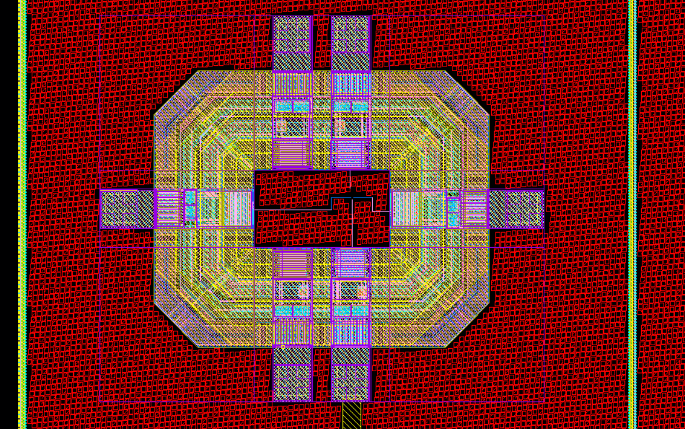
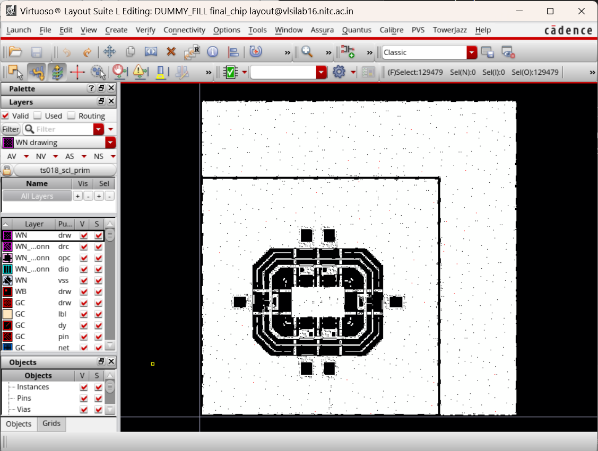
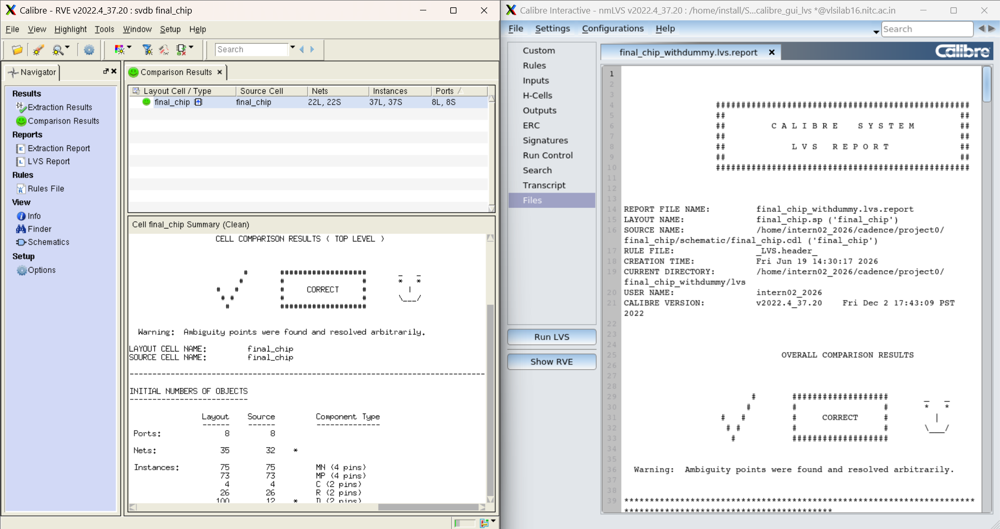
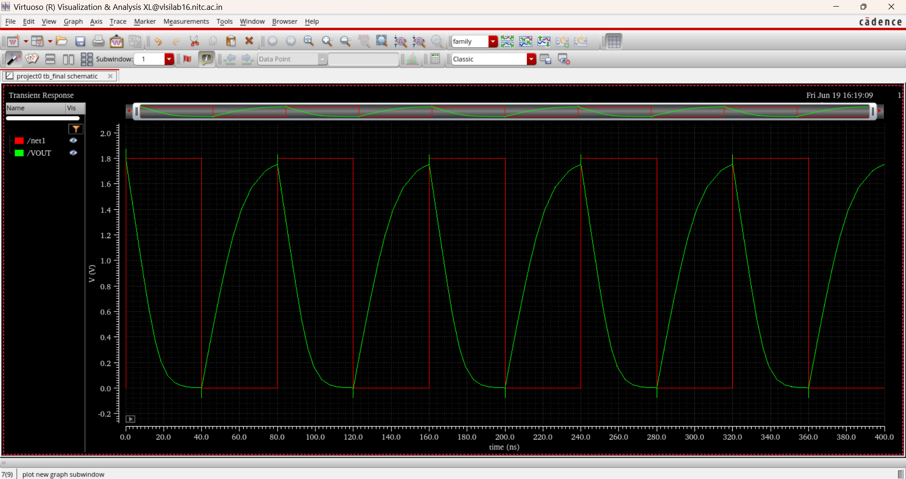
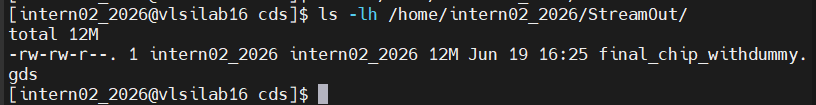

# Day 6 — June 19, 2026

**Focus:** PEX → Seal Ring → Dummy Fill → Final Assembly → DRC/ARC/LVS sign-off → Post-layout simulation → GDS stream-out

## Summary
Completed the full physical design closure flow for `final_chip`. Ran Calibre PEX to extract parasitics, integrated the seal ring and dummy fill, assembled the final `final_chip_withdummy` cell, ran DRC/ARC/LVS sign-off, got post-layout simulation running with IO pad models, and streamed out the final GDS (12MB). This is effectively tapeout-ready output.

---

## What I Did

### 1. PEX — Calibre Run PEX on `final_chip`

- Layout window → **Calibre → Run PEX**
- Inputs tab: Layout format GDSII, export from layout viewer, Source: `final_chip.cdl` (from `/home/intern02_2026/cadence/project0/final_chip/schematic/`)
- Run directory: `/home/intern02_2026/cadence/project0/final_chip/layout/pex/`
- First run had 1 error in the bottom panel (CDL not attached) — re-ran with CDL properly linked
- **Result: xRC Errors = 0, exit code 0**, 28 warnings (all PDK ground layer names — ignorable)

Output netlist: `final_chip.pex.netlist`

Port order extracted from netlist:
```
subckt final_chip ( VSSO VSS VDD VDDO vin EXT_vout EXT_vin PADR_vout )
```


*Calibre xRC — 0 errors, parasitic RC extracted for final_chip, port order confirmed*

### 2. CDF Edit for `final_chip` (Pre-requisite for Post-Layout Sim)

CIW → **Tools → CDF → Edit**
- Scope: Cell | CDF Layer: Base
- Library: `project0`, Cell: `final_chip`

**Component Parameter tab:**
- Added `model` entry: Name=`model`, Type=`string`, Parse as CEL=`yes`
- Click Apply

**Simulation Information tab:**
- By Simulator → `spectre`
- termOrder: `VSSO VSS VDD VDDO vin EXT_vout EXT_vin PADR_vout` (from PEX netlist)
- otherParameters: `model`
- Click Apply → OK

**Spectre view creation:**
- Library Manager → `final_chip` → right-click `symbol` view → Copy → rename To view: `spectre`
- This creates the `spectre` cellview needed for testbench instantiation

### 3. Seal Ring Integration

**Purpose:** Guard structure around the die to prevent die-sawing stress and contamination from reaching the active circuits.

**Stream in seal ring GDS:**
- Created new library `SEALRING` attached to `ts018_scl_prim`
- CIW → File → Import → Stream
  - Stream File: `/home/install/SCL/scl180/ext_str/SEALRING_PAD_PDK2020.gds`
  - Library: `SEALRING`
  - Attach Tech Library: `ts018_scl_prim`
- Result: 0 errors, 69 warnings ✅

**Resize seal ring:**
- Library Manager → SEALRING → open `SCL18_Seal_ring_4M1L_a0` layout
- Selected all layers of each edge using drag-select (must select all layers at once to avoid distortion)
- Pressed `S` to stretch each edge → resized to **1000×1000µm**

**Instantiate in `final_chip` layout:**
- Opened `final_chip` layout
- Create → Instance → SEALRING / SCL18_Seal_ring_4M1L_a0
- Placed around the IO ring
- Drew **TOP_M drawing** rectangle (30µm wide) from VSS terminal of `pv0i` pad down to inner edge of seal ring
- Placed `ML_M3` via at junction between TOP_M wire and M3 VSS terminal
- Saved layout

### 4. Dummy Fill — Calibre nmDRC Custom Mode

**Purpose:** Fill empty metal/active areas to meet density design rules (prevents process issues from sparse layers).

**Steps:**
1. Made run directory: `/home/intern02_2026/cadence/project0/final_chip/dummy_fill/`
2. Opened Calibre → Run nmDRC from `final_chip` layout
3. **Custom tab** → DRC Run Options: `DUMMY_FILL` → selected all dummy layers
4. **Rules tab** → Run Directory: dummy_fill directory
5. **Inputs tab** → Run Options: `FLAT`
6. **Outputs tab** → Format: GDSII, File: `final_chip__dummy.gds` (note double underscore)
7. **Settings → Show Pages → Options** → Options tab → Upper Limit: `All`
8. Run DRC

Result: Generated `final_chip__dummy.gds` with fill patterns for MDP08, MDP40, MDP42, MDP50, MDP44, dumINarea_AA layers.

**Stream in dummy fill GDS:**
- Created library `DUMMY_FILL` attached to `ts018_scl_prim`
- CIW → File → Import → Stream → `final_chip__dummy.gds` into `DUMMY_FILL` library
- Result: cell `final_chip` in DUMMY_FILL with ~129,479 objects (fill rectangles)

### 5. Final Assembly — `final_chip_withdummy`

- Library Manager → project0 → New Cell View: `final_chip_withdummy`, type layout
- Create → Instance → `project0/final_chip/layout` → place at origin (0,0)
- Create → Instance → `DUMMY_FILL/final_chip/layout` → place at origin (0,0)
- Selected both instances → Q → set Origin X=0, Y=0 for both to align
- Saved


*final_chip_withdummy — IOPAD ring + inverter core + seal ring + dummy fill at origin*

Visual result: dummy fill (red pattern) covers all empty areas around IO ring uniformly.


*Calibre DUMMY_FILL output — fill rectangles across MDP and dumINarea_AA layers*

**Note:** Both `project0` and `DUMMY_FILL` have a cell named `final_chip` — this causes a GDS naming conflict during stream-out. The `project0/final_chip` gets renamed to `final_chip_0` in the output GDS. This is a known issue with no impact on the design.

### 6. Final Physical Verification on `final_chip_withdummy`

Made directories:
```bash
mkdir /home/intern02_2026/cadence/project0/final_chip_withdummy/drc
mkdir /home/intern02_2026/cadence/project0/final_chip_withdummy/arc
mkdir /home/intern02_2026/cadence/project0/final_chip_withdummy/lvs
```

#### DRC
- Same flow as before (Calibre nmDRC, BLOCK mode)
- **Result: 4 errors — all `M2.A.1` in IOPAD cell**
  - M2 area must be min 0.202 sq.µm — small M2 fragments in PDK IO pad cells
  - These are foundry-provided PDK cell violations, not user design errors → waivable

#### ARC (Antenna Rule Check)
- Calibre nmDRC → Custom tab → DRC Run Options: `Antenna`
- Run directory: `final_chip_withdummy/arc/`
- **Result: 0 violations ✅**

#### LVS
- LVS run on `final_chip` (not `final_chip_withdummy`) — seal ring and dummy fill are physical-only structures with no schematic equivalent, so LVS is always run on the electrical cell
- CDL generation required special handling:
  - Stop View List must include `layout` to prevent netlister from descending into SEALRING (layout-only cell with no CDF simInfo)
  - Switch View List: `auCdl schematic layout`
  - Stop View List: `auCdl layout`
- Used existing `final_chip.cdl` from Day 5
- **Result: LVS CORRECT ✅**


*final_chip LVS CORRECT — 22 nets, 37 instances, 8 ports, sign-off clean*

  - Nets: 22L = 22S
  - Instances: 37L = 37S
  - Ports: 8L = 8S

### 7. Post-Layout Simulation

Created testbench `tb_final`:
- Copied `inverter_tb` → renamed to `tb_final` in project0
- Replaced inverter instance with `final_chip` spectre view
- Connected all 8 ports:
  - `vin` + `EXT_vin` → pulse source (V0)
  - `VDD` + `VDDO` → vdd (1.8V supply V1)
  - `VSS` + `VSSO` → gnd
  - `EXT_vout` + `PADR_vout` → VOUT net → load cap C0

**ADE-L Model Libraries setup:**
| File | Section |
|------|---------|
| `final_chip.pex.netlist` | (none — top-level include) |
| `ts18scl/default/hspice/ts18sl_scl.lib` | `tt_18` |
| `ts18scl/v2.0/hspice/ts18sl_scl.lib` | `tt_hv` |
| `ts18scl/v2.0/hspice/ts18sl_scl.lib` | `diodes` |
| `ts18scl/v2.0/hspice/ts18sl_scl.lib` | `acc_typ` |
| `ts18scl/default/hspice/ts18sl_scl.lib` | `res2t_typ` |

**Key fix:** IO pad cells (pvdi, pv0i, pvda, pv0a, pc3d00) use resistor models `rnwellsti2t` and `rnmpoly2t` defined in `ts18sl_scl.lib` under the `res2t_typ` section at `/home/install/SCL/scl180/pdk/cdns/sclpdk_v3/HOTCODE/models/ts18scl/default/hspice/`. Using `v2.0` path alone was insufficient — the `default` path version has the `res2t_typ` section.

**Result: Simulation successful ✅**
- Transient waveform shows inverter function through IO pads
- Output (green) correctly inverts input (red) with realistic RC delay — edge rounding from IO pad parasitics visible


*Post-layout transient — inverter function verified through IO pads, RC edge rounding from pad parasitics*

### 8. Final GDS Stream-Out

```bash
mkdir /home/intern02_2026/StreamOut
```

CIW → **File → Export → Stream**:
- Stream File: `/home/intern02_2026/StreamOut/final_chip_withdummy.gds`
- Library: `project0`
- Top Cell: `final_chip_withdummy`
- View: layout
- Technology Library: `ts018_scl_prim`
- Layer/Object maps: auto-filled from ts018_scl_prim

Result:
```
-rw-rw-r--. 1 intern02_2026 intern02_2026 12M Jun 19 16:25 final_chip_withdummy.gds
```

**12MB GDS — full chip with IO ring, seal ring, and dummy fill. Tapeout-ready.**

---


*GDS stream-out — final_chip_withdummy.gds, 12MB, tapeout-ready*

## Key Concepts

**Seal Ring** — A continuous metal ring placed at the die boundary. Protects the active circuits from mechanical stress during die sawing and from contamination. Must be connected to VSS. Width should be ≥11µm; inner edge must be ≥10µm from active area.

**Dummy Fill** — Metal/active rectangles inserted into sparse regions to meet density design rules. Required by foundries to ensure uniform CMP (Chemical Mechanical Planarization) and process stability. Generated by Calibre nmDRC in DUMMY_FILL custom mode — outputs a GDS, not DRC violations.

**TOP_M Layer** — The topmost metal layer (Metal 4 in SCL 4M1L process). Used for wide power/ground connections and the seal ring VSS tie. Select `TOP_M drawing` from layer palette.

**`res2t_typ` Section** — The model section in `ts18sl_scl.lib` that defines IO pad resistor subcircuits (`rnwellsti2t`, `rnmpoly2t`, `rphpoly2t` etc.). These are built-in protection resistors inside the IO pad cells. Required for post-layout simulation of any design using SCL cio150 pads. Found in the `default` path, not `v2.0`.

**LVS on `final_chip` not `final_chip_withdummy`** — Seal ring and dummy fill have no schematic representation. LVS compares electrical content only. Always run LVS on the electrical cell (`final_chip`), not the final assembly cell that includes physical-only structures.

**DUMMY_FILL naming conflict** — When both `project0` and `DUMMY_FILL` libraries contain a cell named `final_chip`, stream-out renames one to `final_chip_0`. This is expected and harmless — the GDS hierarchy is still correct.

---

## Issues & Fixes

| Issue | Root Cause | Fix |
|-------|-----------|-----|
| PEX first run had 1 error | CDL netlist not attached in Inputs tab | Re-ran PEX with CDL properly linked under Source Path |
| CDL export failed for `final_chip_withdummy` | SEALRING cell has no CDF simInfo (layout-only) | Add `layout` to Stop View List and Switch View List so netlister stops at seal ring boundary |
| LVS on `final_chip_withdummy` gave 12 discrepancies | Seal ring/dummy fill have no schematic — ports missing | Run LVS on `final_chip` directly, not the withdummy assembly |
| Post-layout sim: `rnwellsti2t` undefined | IO pad resistor models in `res2t_typ` section not included | Add `ts18scl/default/hspice/ts18sl_scl.lib` with section `res2t_typ` to Model Libraries |
| Spectre view copy: "Locked" error | Symbol view was open in another window | Close all `final_chip` symbol windows before copying |
| GDS naming conflict: `final_chip` → `final_chip_0` | Both project0 and DUMMY_FILL have a `final_chip` cell | Known issue — harmless, stream-out still succeeds |

---

## Final Sign-Off Summary

| Check | Result |
|-------|--------|
| DRC | 4 waivable M2.A.1 errors (PDK IOPAD cells) |
| ARC | 0 violations ✅ |
| LVS | CORRECT ✅ (22 nets, 37 instances, 8 ports) |
| Post-Layout Sim | Passing — inverter function verified through IO pads ✅ |
| GDS Stream-Out | `final_chip_withdummy.gds` — 12MB ✅ |

---

## Key Paths

```
PEX netlist:    /home/intern02_2026/cadence/project0/final_chip/layout/pex/final_chip.pex.netlist
Dummy fill GDS: /home/intern02_2026/cadence/project0/final_chip/dummy_fill/final_chip__dummy.gds
Seal ring GDS:  /home/install/SCL/scl180/ext_str/SEALRING_PAD_PDK2020.gds
IO pad models:  /home/install/SCL/scl180/pdk/cdns/sclpdk_v3/HOTCODE/models/ts18scl/default/hspice/ts18sl_scl.lib
Final GDS:      /home/intern02_2026/StreamOut/final_chip_withdummy.gds
```

---

## Resources
- Calibre nmDRC/nmLVS/xRC v2022.4
- Cadence Virtuoso IC618
- NIT Calicut analog VLSI lab manual (Part 2) — Sections 4–9
